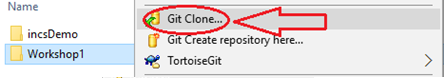

# Computer preparation and Getting Workshop files

## Setting up your computers for BTP200

Installation guides for preparing your computer for the subject can be found in this playlist on YouTube:

[Seneca "how to" videos for C/C++ Core subjects](https://www.youtube.com/playlist?list=PLxB4x6RkylosAh1of4FnX7-g2fk0MUeyc)

OR:

Go to this url: https://tinyurl.com/200setup


## Getting Workshop Files

(if you have not followed the Installation guides to prepare your computer go to **Using [Download Zip](#using-download-zip)**)

### Using [Git](https://git-scm.com/download/win)

- Open https://github.com/Seneca-244200/BTP-Workshops and click on “Code” Button; this will open “Clone with HTTPS” window.


  If the window is titled “Clone with SSH” then click on “Use HTTPS”:
  

- Copy the https URL by clicking on the button on the right side of the URL:
    

- Open File Explorer on your computer and select or create a directory for your workshops.

### Using [ToroiseGit](https://tortoisegit.org/download/)

- Right click on the selected directory and select “Git Clone":
    

- This will open the “Git Clone” window with the URL already pasted in the “URL” text box; if not, paste the URL manually:
    

- Click on ok

This will create on your computer a clone (identical directory structure) of the directory on Github.  Once you have cloned the directory, you can open the workshop directory **BTP-Workshops/WS??** and start doing your workshop. Note that you will repeat this process for all workshops and milestones of your project in this subject.

If your professor makes any changes to the workshop or a new workshop is released, you can right click on the cloned repository directory and select **Tortoise Git/pull** to update and sync your local workshops repositoryy to the one on Github with-out having to download it again. Note that this will only apply the changes made and will not affect any work that you have done on your workshop.

### Using Command line

- Open the git command line on your computer.
- Change the directory to your workshops directory.
- Issue the following command at the command prompt in your workshops directory:

  ``` bash
  git clone https://github.com/Seneca-244200/BTP-Workshops.git
  ```

The URL for all the workshops are the same throughout the semester. The only thing that changes, is the workshop number.

This will create a clone (that is an identical directory structure and content to the one Github) of the BTP-Workshops repository on your computer.  Once you have cloned the directory, you can open the subdirectory the workshop and start doing your work. Note that you will repeat this process for all workshops and milestones of your project in this subject.

If your professor makes any changes to the workshop, you can issue the command

  ```bash
  git pull
  ```

in the cloned repository directory to update and sync your local workshop to the one on Github without having to download it again. Note that this will only apply the changes made and will not affect any work that you have done on your workshop.

### Using Download ZIP

Open https://github.com/Seneca-244200/BTP-Workshops and click on “Code” button and click on “Download ZIP”.

  

This will download a zipped file copy of the workshop repository from Github to your computer. You can extract this file to where you want to do your workshop.

Note that, if your professor makes any changes to the workshop, to get them you have to separately download another copy of the workshop and manually apply the changes to your working directory to **make sure nothing of your work is overwritten by mistake**.


## Seeking help from your professors using Git

Here is a playlist of instructional videos that helps you set up your Github account and your computer to work on your problems with your professors' using Github:

[Setting Github for School Work and Collaboration](https://www.youtube.com/playlist?list=PLxB4x6RkylotpVj3V33D4Q28emnh6yiit)

## Improtant Notes

- Install [GlobalProtect](https://students.senecapolytechnic.ca/spaces/186/it-services/wiki/view/1024/vpn) on your computer to have access to internal services of Seneca and the Matrix Linux cluster.
- When transferring program files to Matrix using an SFTP or SSH client, make sure your transfer mode is always set to **TEXT**.


## Matrix Linux Cluster

The matrix connection settings are:
- server address: `matrix.senecapolytechnic.ca`
- port: `22`
- your Seneca username/password (the same you use for email or blackboard)

When connecting to matrix you will need:
- an SFTP client. SFTP is a protocol to transfer files between computers over an encrypted connection. `WinSCP`, available in *MyApps*, is a modern, free, and easy-to-use Windows application that can be used for this purpose. See the official documentation (https://winscp.net/eng/docs/guide_secure) and a more detailed tutorial (https://blog.eldernode.com/use-winscp-transfer-files/).
- an SSH client. SSH is a protocol for getting a secure command prompt (so you can issue commands and execute scripts) on a remote machine.  `Putty`, available in *MyApps*, is a free and easy-to-use Windows application that can be used for this purpose. See a tutorial (https://tonyteaches.tech/putty-ssh-windows-tutorial/).

There are dozens of other clients; if you are more confortable using something else, please do so. Also, if you use another operating system, search for clients available on your platform.

If you attempt to connect to `matrix`, but the connection cannot be established:
- check that you have internet access from your machine
- **if you are not in campus, check that you are connected to VPN using GlobalProtect**. You do not need VPN if you access `matrix` from campus.
- check that there is no typo in the server address
- check that the port is set to `22`.

If it still doesn't work, contact Seneca Service Desk (servicedesk@senecapolytechnic.ca) so they can assist you.


### Command-Line clients for SSH & SFTP (for advanced users)

If you prefer command-line clients to connect to `matrix`, you can use:
- `ssh` command (tutorial here https://www.digitalocean.com/community/tutorials/how-to-use-ssh-to-connect-to-a-remote-server)
- `sftp` command (tutorial here https://www.digitalocean.com/community/tutorials/how-to-use-sftp-to-securely-transfer-files-with-a-remote-server)

The advantages of these tools:
- are free and open source
- available in all modern operating systems (Windows, MacOS, Linux, Unix); they come with the OS and are already installed (usually); for older OS you will have to install them yourself
- work almost identical in all operating systems (learn them once, use them everywhere)
- can be used for scripting to automate activities
